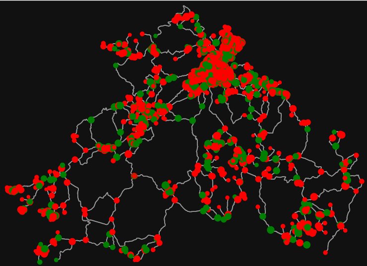
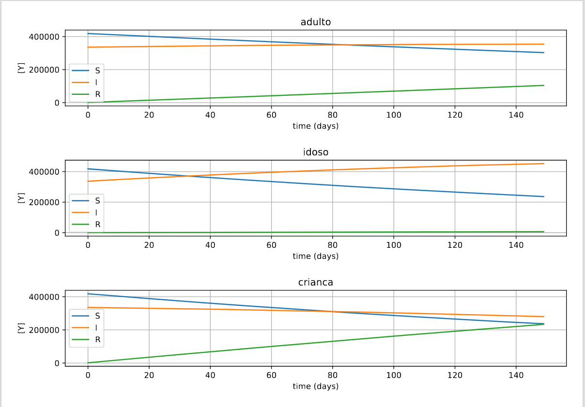

# Simulação de Propagação de Doença usando Modelo SIR em Rede

Este projeto tem como objetivo simular a propagação de uma doença seguindo o modelo SIR (Susceptíveis-Infectados-Recuperados) em uma rede. A rede é construída usando a biblioteca OSMnx, onde cada vértice representa uma classe região. Cada região possui suas próprias populações, cada uma com suas taxas específicas.

## Configuração do Ambiente

Antes de executar a simulação, é necessário configurar o ambiente com as dependências corretas. Certifique-se de ter o Python instalado em sua máquina. Em seguida, você pode criar um ambiente virtual e instalar as dependências usando o seguinte comando:

```
$ pip install -r requirements.txt
```

## Carregamento da Rede

A rede é carregada usando a biblioteca OSMnx, que permite obter dados geográficos da infraestrutura de transporte de uma região específica. A partir dos dados obtidos, os vértices da rede são convertidos em instâncias da classe Regiao. Cada região representa uma área geográfica específica onde a simulação ocorrerá.

## Simulação da Propagação

A simulação da propagação da doença ocorre através do desenvolvimento em cada região. A cada passo da simulação, as populações em cada região são atualizadas de acordo com as taxas de infecção, recuperação, mortalidade e nascimento definidas para cada população. O modelo SIR é aplicado para determinar a evolução dos indivíduos em cada população ao longo do tempo.

## Movimento das Populações entre Regiões

Além da propagação da doença dentro de cada região, também simulamos o movimento das populações entre as regiões. Com base na taxa de mobilidade definida para cada população e nas conexões entre as regiões na rede, os indivíduos podem se mover de uma região para outra. Isso permite modelar o espalhamento da doença através de deslocamentos geográficos.

## Resultados e Visualização

Ao final da simulação, os resultados serão apresentados, incluindo gráficos que mostram a evolução das populações ao longo do tempo e a propagação da doença na rede.

### Mapa da Rede e Propagação da Doença

Será gerado um mapa da rede, onde cada vértice representa uma região e suas respectivas populações. O tamanho do vértice é proporcional à quantidade de indivíduos na região, e a cor do vértice representa o estado da maioria dos indivíduos daquela região (Suscetível, Infectado ou Recuperado).



### Evolução das Populações por Estados SIR

Também será apresentado um gráfico que mostra a evolução da concentração total de cada população, considerando os estados SIR (Suscetível, Infectado, Recuperado), ao longo do tempo durante as simulações.


